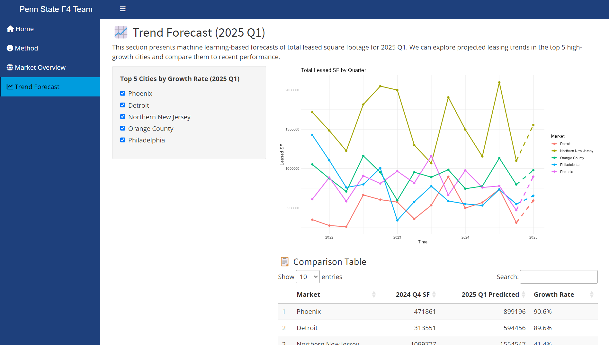
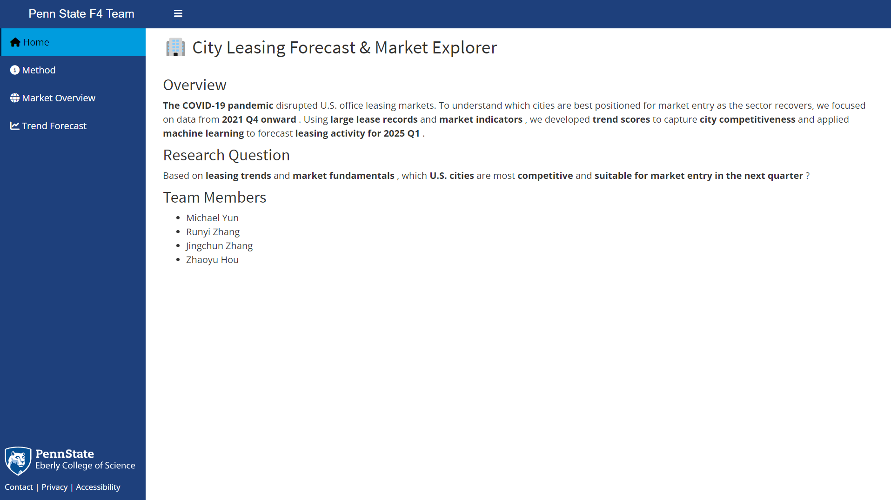
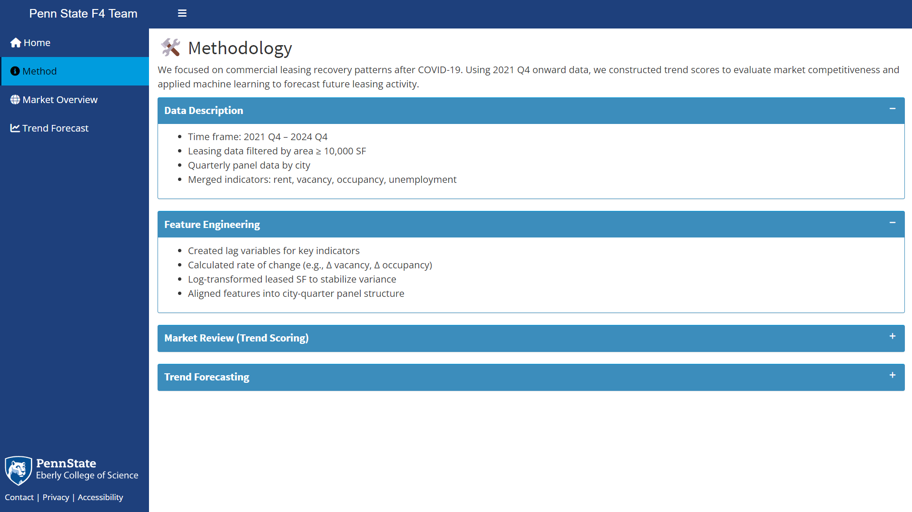
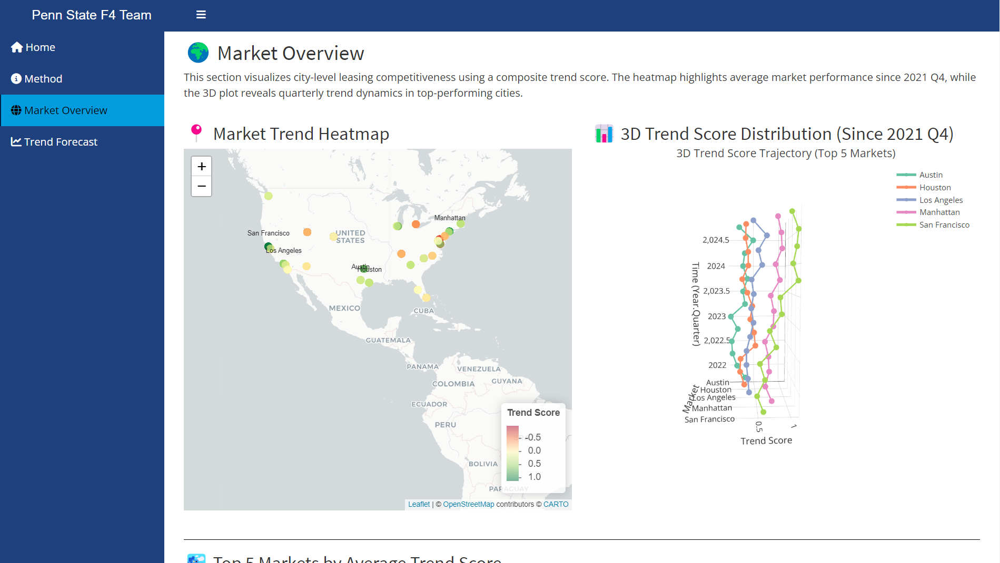

# City Leasing Forecast & Market Explorer

> Interactive R Shiny dashboard for forecasting U.S. office leasing activity in the post-COVID recovery, built around a composite trend-scoring framework and an XGBoost regression pipeline on city-quarter panel data.
>
> **2025 ASA DataFest · Penn State University · Team F4**



---

## Why this exists

The COVID-19 pandemic structurally disrupted U.S. commercial office leasing markets. By 2024, recovery was uneven — some metros had rebounded past pre-pandemic levels while others remained structurally impaired. For an investor or operator looking to time market entry, the question is no longer "is the office market recovering?" but rather "**which cities, in which quarter**, are best positioned for sustained leasing activity?"

This project answers that question by combining:

1. **A composite trend score** — standardizing five market fundamentals (leased SF, rent, vacancy, occupancy, unemployment) into a single competitiveness index per city-quarter.
2. **An XGBoost regression forecast** — predicting next-quarter total leased SF using lagged panel features and interaction terms.
3. **An interactive Shiny dashboard** — surfacing both the score and the forecast through a Leaflet heatmap, a Plotly 3D trend visualization, and a top-5 city forecast comparison.

Built for the ASA DataFest 2025 national competition, where teams analyzed a proprietary commercial real-estate dataset over a fixed competition window.

---

## Dashboard

The Shiny app is organized into four pages:

| Page | Function |
|---|---|
| **Home** | Project overview, research question, team |
| **Methodology** | Data description, feature engineering pipeline, trend-score formula (rendered via MathJax), XGBoost training spec |
| **Market Overview** | Leaflet geospatial heatmap of city-level competitiveness + Plotly 3D trend-score surface over time + DataTable of top-5 markets |
| **Trend Forecast** | XGBoost forecast for 2025 Q1 across selected top-growth cities + comparison table vs prior quarter |

### Screenshots

#### Home
Project overview, research question, and team. Entry context for the dashboard.



#### Methodology
Data sources, feature-engineering pipeline, the trend-score formula rendered via MathJax, and the XGBoost training specification.



#### Market Overview
Leaflet geospatial heatmap of average city-level trend scores, a Plotly 3D surface showing trend-score evolution over time across selected cities, and a DataTable of the top-5 markets by average score.



#### Trend Forecast
XGBoost forecast of total leased SF for 2025 Q1 across selected top-growth cities, with a side-by-side comparison vs the prior quarter (2024 Q4).


---

## Methodology

### 1. Data

Four input datasets covering U.S. commercial real-estate and labor market conditions:

| Dataset | Granularity | Use |
|---|---|---|
| `Leases.csv` | Lease-level | Aggregated to market-quarter total leased SF (filtered to ≥10,000 SF, year ≥ 2020) |
| `Price and Availability Data.csv` | Market-quarter | Mean overall rent, availability proportion |
| `Major Market Occupancy Data.csv` | Market-quarter | Average occupancy proportion |
| `Unemployment.csv` | State-month | Aggregated to state-quarter, joined into market-quarter panel |

**Coverage**: 2021 Q4 – 2024 Q4. **Unit of observation**: market × quarter.

### 2. Feature Engineering (`R/build_features.R`)

- Filter leases to ≥10,000 SF transactions, year ≥ 2020
- Aggregate from lease-level to market-quarter panel (`group_by(year, quarter, market)`)
- Join rent, occupancy, and quarterly unemployment
- **MICE multiple imputation** for missing values (`m = 5`, predictive mean matching, seed = 123) — applied jointly across rent, availability, occupancy, and unemployment
- Log-transform `total_leased_sf` and `overall_rent` for variance stabilization

### 3. Trend Score (`R/trend_scoring.R`)

A composite competitiveness index defined as:

```
                  Z_leased_sf − Z_rent − Z_vacancy + Z_occupancy − Z_unemployment
TrendScore(i,t) = ───────────────────────────────────────────────────────────────
                                              5
```

Where each Z is the z-standardized value of the indicator across the full city-quarter panel. Higher score → more competitive market. Sign convention: rent, vacancy, and unemployment enter negatively (lower is better for leasing activity); leased SF and occupancy enter positively.

### 4. Forecast Model (`R/train_model.R`)

- **Algorithm**: XGBoost regression, `objective = "reg:squarederror"`, `nrounds = 100`
- **Target**: `log1p(total_leased_sf)` at quarter *t+1*
- **Features**:
  - Lag-1 versions of: log leased SF, log overall rent, availability, occupancy, unemployment
  - Interaction terms: `rent × availability`, `rent × unemployment` (lagged)
  - Linear time trend
  - Market fixed effects (via one-hot encoding through `model.matrix`)
- **Train/validation split**: 80% / 20%, `set.seed(42)`
- **Evaluation**: RMSE, MAE, R² on validation set
- **Output**: Forecast for 2025 Q1 by city, with implied growth rate vs 2024 Q4

### Validation results

<!-- TODO: 跑一次 train_model.R 把 xgb_model_metrics.csv 的值填进来 -->

| Metric | Value (log scale) |
|---|---:|
| RMSE | `_TODO_` |
| MAE | `_TODO_` |
| R² | `_TODO_` |

---

## Pipeline

```
Raw CSVs (4 sources)
       │
       ▼
build_features.R  ──►  MICE imputation  ──►  features.csv (market × quarter panel)
       │
       ├──►  trend_scoring.R   ──►  trend_scores.csv  ──►  Shiny: Market Overview
       │
       └──►  train_model.R     ──►  forecast_2025Q1_xgb.csv  ──►  Shiny: Trend Forecast
                                    xgb_model_trained_final.rds
                                    xgb_model_metrics.csv
```

---

## Stack

- **App framework**: R Shiny, `shinydashboard`, `shinyBS`, `shinyWidgets`, `boastUtils` (BOAST template)
- **Visualization**: `leaflet` (geospatial heatmap), `plotly` (3D surface), `DT` (interactive tables), `ggplot2`, `fmsb`
- **Data**: `dplyr`, `tidyr`, `readr`, `lubridate`
- **ML / stats**: `xgboost`, `caret`, `Metrics`, `mice`

---

## Setup

```r
# Install dependencies
install.packages(c(
  "shiny", "shinydashboard", "shinyBS", "shinyWidgets",
  "leaflet", "plotly", "DT", "fmsb",
  "dplyr", "tidyr", "readr", "lubridate",
  "xgboost", "caret", "Metrics", "mice", "DiagrammeR", "ggplot2"
))
# boastUtils is from BOAST team
remotes::install_github("EducationShinyAppTeam/boastUtils")
```

To rebuild the pipeline from raw data (data not included — see "Data Availability"):

```r
source("R/build_features.R")    # → data/processed/features.csv
source("R/trend_scoring.R")     # → trend_scores.csv
source("R/train_model.R")       # → forecast_2025Q1_xgb.csv + metrics
```

To launch the dashboard:

```r
shiny::runApp()
```

---

## Limitations

1. **Single forecast horizon** — model is trained to predict t+1 (next quarter); multi-step forecasts are not supported in the current pipeline.
2. **Equal weighting in trend score** — the five components are weighted equally; there is no learned weighting reflecting which indicator best predicts subsequent leasing activity.
3. **Linear time trend only** — the model captures secular trend via a single `time_trend` feature; structural breaks (e.g., the COVID dislocation, rate-hike regime shifts) are not explicitly modeled.
4. **Cross-sectional dependencies** — markets are treated as independent panels; spatial spillovers between adjacent metros are not modeled.
5. **MICE assumptions** — predictive mean matching assumes data are missing at random conditional on observed covariates; this is plausible for our setting but not directly testable.

---

## Data Availability

Due to data licensing agreements, the original leasing dataset has been removed from the repository. The R code and Shiny app are fully published for reference and methodology review. To reproduce the full pipeline, the proprietary source files are required:

- `Leases.csv`
- `Price and Availability Data.csv`
- `Major Market Occupancy Data.csv`
- `Unemployment.csv`

Competition judges, instructors, and reviewers can contact the team for access.

---

## Team

Penn State F4 Team — 2025 ASA DataFest, Penn State University:

- [Michael Yun](https://github.com/Migueldesanta) — feature engineering, XGBoost model, forecast pipeline
- [Runyi Zhang](https://github.com/RunyiZhang)
- [Jingchun Zhang](https://github.com/Jingchunz)
- [Zhaoyu Hou](https://github.com/zhaoyuhou)

<!-- TODO: 填上每个 teammate 的具体 contribution，如「Runyi Zhang — trend scoring methodology」-->

---

## Acknowledgements

The Shiny app structure is forked from [EducationShinyAppTeam/App_Template](https://github.com/EducationShinyAppTeam/App_Template), originally developed by the Education Shiny App Team (BOAST) at Penn State. The data-processing pipeline, trend-scoring framework, XGBoost model, and visualizations are original work.

---

## License

This project is licensed under **Creative Commons Attribution-NonCommercial-ShareAlike 4.0 International (CC BY-NC-SA 4.0)**.

You are free to share and adapt the material under the conditions of attribution, non-commercial use, and share-alike. Full terms: https://creativecommons.org/licenses/by-nc-sa/4.0/

---

## Disclaimer

This dashboard is a research and educational artifact developed for an academic competition. It is not investment advice. Forecasts are point estimates from a single-horizon model trained on a limited time window, and should not be used as the sole basis for any real-estate or financial decision.
