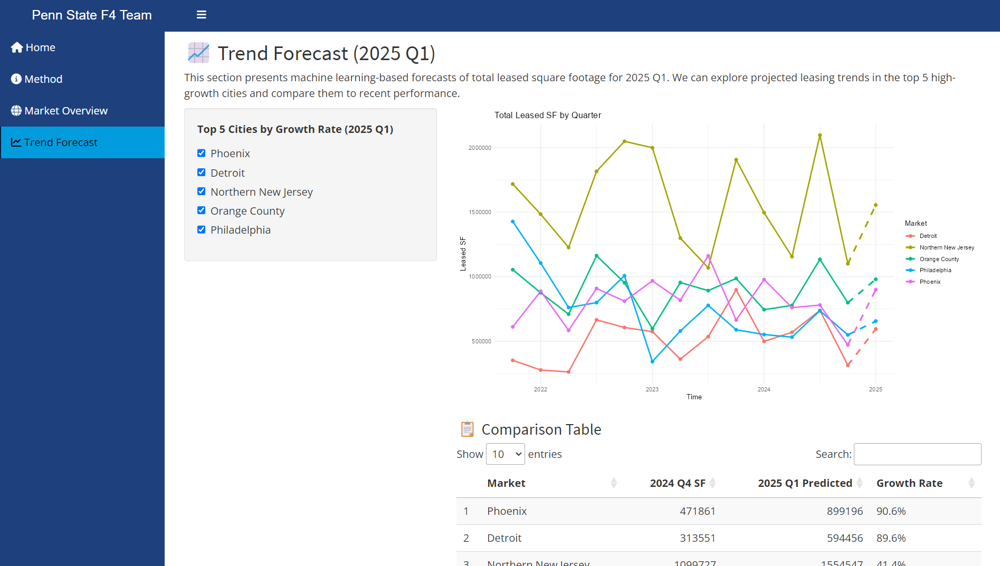

# 🏢 City Leasing Forecast & Market Explorer

An interactive Shiny dashboard for analyzing U.S. office leasing trends and forecasting 2025 Q1 leasing activity using machine learning.

---

## 🏆 Competition

This project was developed as part of the **2025 ASA DataFest at Penn State University**, a national data science competition organized by the American Statistical Association.

---

## 📌 Project Objective

To identify the most competitive and investment-ready U.S. cities in the post-COVID leasing market using trend scoring and forecasting models.

---

## 📁 App Structure

The dashboard includes four interactive pages:

1. **Home** – Project overview and team  
2. **Method** – Data, feature engineering, and model methodology  
3. **Market Overview** – Heatmap and 3D trend score visualizations  
4. **Trend Forecast** – Leasing growth forecast for 2025 Q1

---

## 🧠 Methods Summary

- **Data Period:** 2021 Q4 to 2024 Q4  
- **Trend Score:** Composite Z-score using rent, vacancy, occupancy, unemployment, and leased SF  
- **Model:** XGBoost regression on lagged features  
- **Target:** Forecast 2025 Q1 leased square footage

---

## 📸 Screenshots

### 🏠 Page 1 – Home

### 🛠️ Page 2 – Methodology

### 🌍 Page 3 – Market Overview

### 📈 Page 4 – Trend Forecast

---

## 👥 Team

- [MichaelYun](https://github.com/Migueldesanta)
- @RunyiZhang  
- @JingchunZhang  
- @ZhaoyuHou

---

## 📄 License

This project is licensed under the **Creative Commons Attribution-NonCommercial-ShareAlike 4.0 International (CC BY-NC-SA 4.0)** license.

You are **free to**:
- Share — copy and redistribute the material in any medium or format  
- Adapt — remix, transform, and build upon the material  

**Under the following terms**:
- **Attribution (BY):** You must give appropriate credit and indicate if changes were made.  
- **NonCommercial (NC):** You may not use the material for commercial purposes.  
- **ShareAlike (SA):** If you remix, transform, or build upon the material, you must distribute your contributions under the same license as the original.

🔗 License details: [https://creativecommons.org/licenses/by-nc-sa/4.0/](https://creativecommons.org/licenses/by-nc-sa/4.0/)

---

